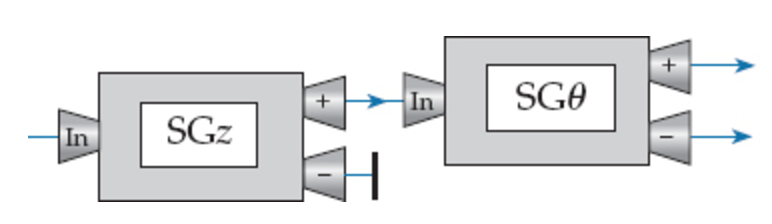

Stern-Gerlach Experiment Calculator
==========================================
A Stern-Gerlach device demonstrates the intrinsic quantum property of atomic-scale systems which is that the spatial orientation of angular momentum is quantized. 

The experiment involves sending a beam of particles through a magnetic field and observing their deflection. Results show that particles possess an intrinsic angular momentum, but unlike the angular momentum of a classically spinning object, the angular momentum of a particle takes only certain quantized values.

In addition to this concept, only one component of a particle's spin can be measured at a time, meaning that taking a measurement of the spin along a particle's Z axis destroys information about the same particle's spin along the X and Y axis.

## Files
* [Run.java](src/sgdevice/Run.java)
	* Initiates the calculator.
	* Includes a command prompt; the listed commands are sufficient to create SG devices and navigate between parent devices, children devices, and sibling devices.
	* Also includes some of the command executables, although this will most likely be moved into Mover.java.
* Device.java
	* Defines the properties and attributes of the Stern-Gerlach device.
	* Includes standard GET/SET.
	* A SG device only has one essential component, which is its Orientation. Traditionally, particles have their spin measured along the Z axis, but functionality exists for measuring spin along the X axis and a variable axis.
* Mover.java
	* A node object used to draw the SG device tree.
	* A mover object (essentially a node) has a:
		* Parent mover.
		* An ArrayList of children movers.
		* An integer dictionary.
		* An encapsulated SG device.
	* Each mover object is basically a SG device. The mover object is only used to link the SG devices together, and in this regard, the mover object is a node.
* Holder.java
	* A temporary holder object (just in case).
	* Not currently being used.

## How-to
1. When you run the project, a root node is created, and you'll be prompted to choose an orientation for this node. In essence, this is the first SG device in the tree.
```
Choose an orientation for this device [z][x][other][theta][closed][open]: 
```
2. After this, you will be presented with a list of commands. From here onwards, you can choose any of the listed options, including adding children, tracing layers, etc. 
```
Commands: 
   [calculate] : calculate eigenvectors for particular result
   [goto child] : navigate to child number # (starting from 0)
   [goto parent] : navigate to the parent
   [goto sibling] : navigate to a sibling #
   [add child] : add a child (you will be promped to define an SG Device
   [trace device] : how many devices in a row
```
3. When you're ready to calculate the SG probability for a chain of devices, use the ```[calculate]``` command.


## Example Operation

A very simple SG scenario is shown in the image above. How would I use the calculator to calculate the probability that a particle entering the first SG device would come out of the negative channel of the second SG device, where the angle of the second SG device is 90°?
1. Run the program and set the orientation of the root node to be aligned with the Z axis. 
2. Add a child, and set its orientation to ```other```. This will prompt you for an angle (degrees), which we will put as ```90```. 
3. After you have created a child (from your root SG device), you must ```goto``` the child before you can perform any operations on it. Thus, use the ```goto child``` command, which will prompt you for the child number. It is the case with the SG tree that any SG device only has two children, numbered ```0``` and ```1```, so in this case, respond to the prompt with ```0``` to go to the child you have just created.
4. We will now create two more children. At this point however, it is not important what orientation these children are in; the point of creating these children is to determine which channel we are concerned with calculating from. It is important to note that the first child created on any parent will be affixed to the parent's positive channel. This child is numbered ```0```. To access the negative channel of a parent, you must create a second child, numbered ```1```. Therefore, since we are concerned with the negative channel, we must run ```add child``` twice more.
5. Now, we will move to the negative channel, and from there we will perform the calculations. Input ```goto child```, and then ```1``` for the negative channel child.
6. Now, simply input ```calculate``` and the result for the probability will appear. This is the probability that a particle entering the first Z-oriented SG device will appear out of the negative end of the 90°-oriented second SG device.
All inputs are shown below:
```
z
add child
other
90
goto child
0
add child
open
add child
open
goto child
1
calculate
```

## To Do List


